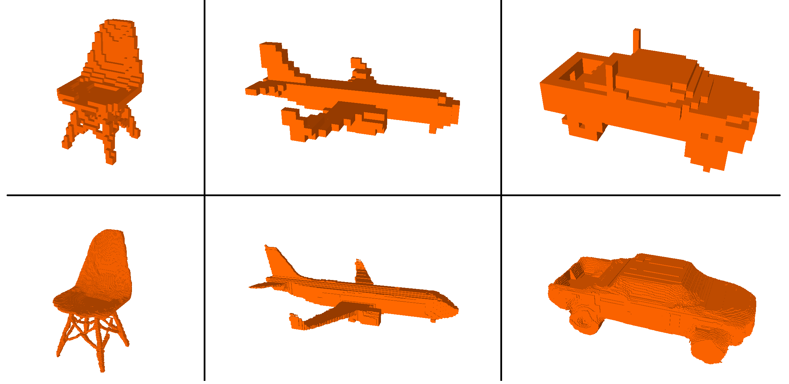
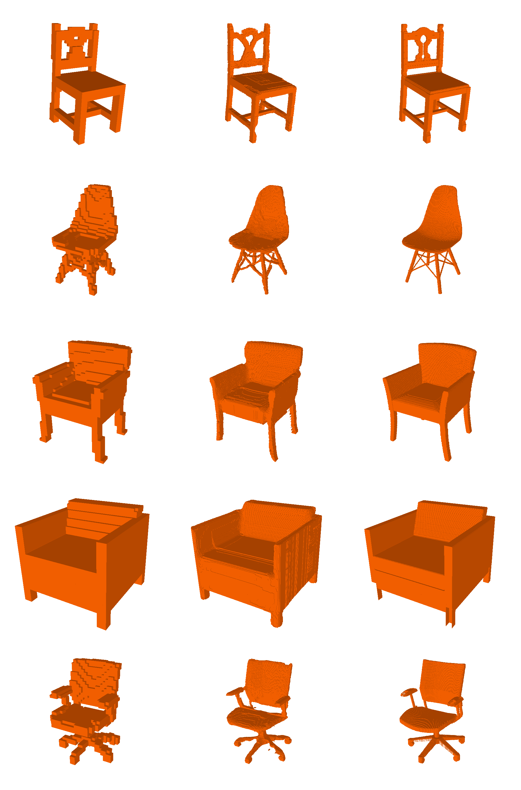
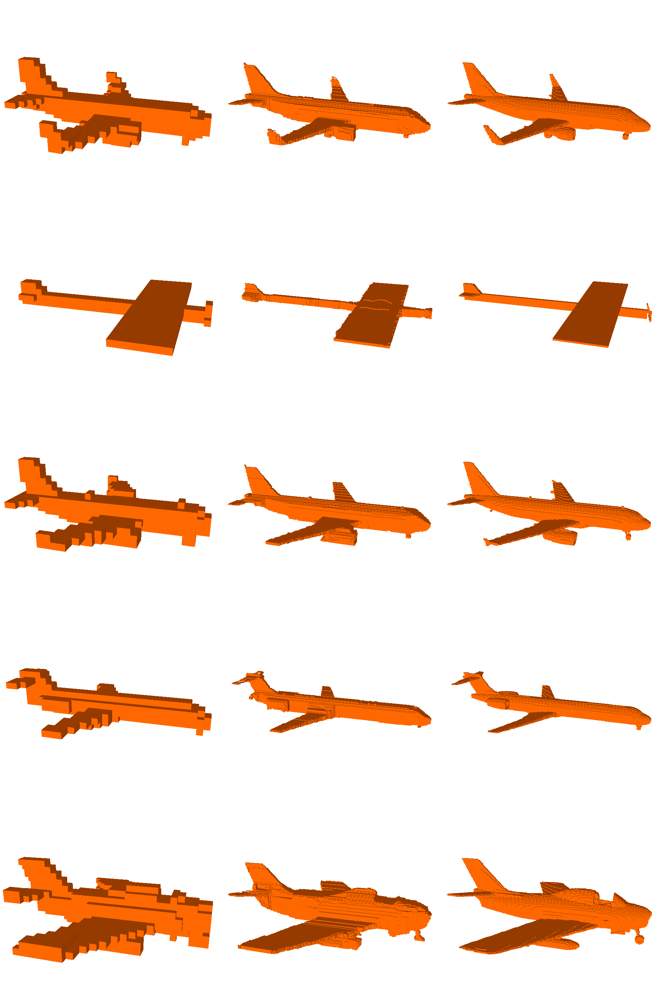
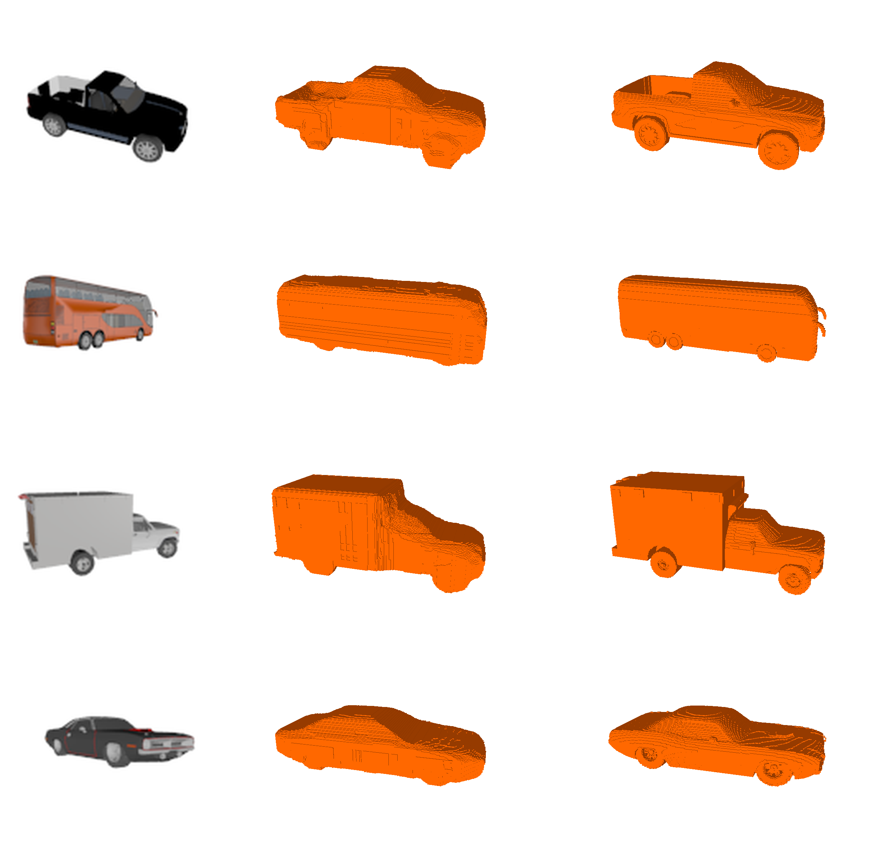

# 3D Object Super-Resolution
This is a repository to reproduce the method from the paper "3D Object Super-Resolution". The code here allows one to train models to accuractly and efficently upsample voxelized objects to high resolutions, and to reconstruct voxelized objects from single RGB images at high resolutions.


<p align="center">
  
</p>

Example super-resolution results, when increasing from 32^3 resolution to 256^3 resolution. The first row is the low resolution inputs and the second row is the corresponing high resolution predictions. 

## Data Production
 To produce the data needed to train and test the moethods of this project we have the 'data_prep.py' script. This will donwload object CAD from the core classes of the ShapeNet dataset, convert the objects to voxel objects, exctract othographic depth maps, render the obejcts as images, and split all the data into training, valiation of test sets. This script makes use of the binvoxer executable, so first call 
 ```bash
sudo chmod 777 binvox 
```
Blender is also needed for this project so please ensure it is installed before biggining. 
 ```bash
sudo apt install blender
```
By default this scripts downloads the full chair class, to uspcale from 32^3 to 256^3 resolution, and renders 10 objects for each object. To achive this call: 
 ```bash
python data_prep.py
```
As an example to futher understand how to customize the data, to produced 1000 plane objects for 64 -> 128 resolution increase, render 5 images per plane call, and not supress error messages call:
 ```bash
python data_prep.py  -o plane -no 1000 -ni 5 -hi 128 -l 64 -debug True 
```

## Super-Resolution
The first element of this repo is the 3D super-resolution method. For this method 6 primary orthographic depth maps(ODM) are extracted from the low resolution object, and passed through our image super resolution method to produce a prediction for the corresponding high resolution object's 6 primary OMDs. The predicted ODM's are then used to carve away at the low resolution object(upsampled ot the higher resolution using nearest nighbor interpolation), to produce an estimate for the high resolution object. 


Intuitive Diagram to understand the 3D super-resolution method. 

The image super-resolution technique used to predict high resolution odms, makes use to two deep convolutional neural networks. The first network, outlined in 'depth.py', estimates only the new depths into the known surface of the low resolution object  within a predefined range. The output of this network is added the corresponing low resolution odms(upsampled to the higher resolution), to produce a complete estimate for the depths to the new objects surface. The second network, outlined in 'occupancy.py", predicts an occupancy map for the high resolution odm, basically predicting silhouettes for the predicted object. The outputs of these two networks are combined to produce a rough estimate of the high reoslution ODM, and then smoothed to produce a final prediction. 


Intuitive Diagram to understand the 3D super-resolution method. 

 - To train the depth map prediction network call: 

```bash
python depth.py
```

 - To train the occupancy map prediction call: 

```bash
python occupancy.py
```

- To evaluate the Super Resolution prediction call: 

```bash
python SREval.py
```
These all assume the default chair classes is being increased from resolution 32 to resolution 256. To alter this call each script with the -h argument to view how to change each parameter. The two networks should not need more then 100 epochs to train fully, and graphs are created and saved in the '/plots/' directory should you wish to stop training early. The 'SREval.py' script will show predicted high resolution objects one at a time using meshlab. If you do not have meshlab installed call: 

```bash
sudo apt-get install meshlab
```
 The overhead for this script is converting the large voxel life into a mesh for viewing, the actual method is quite fast. 

<ul align="center">
  
  
</ul>
Exmaple objects reconstructed from images. For each class, the left shows the input images, the center shows the predicted objects, and the right the ground truth. High definition copies of these images can be found in the Images folder.  


## High Resolution Single Image Object Reconstruction 
The second element of this repo is applying our Super-Resolution method to reconstructing high resolution obejcts from single RGB images. For this application an ensemble of auto-encoders is used to produce low resolution reconstructions of objects from images, and then our super resolution method is applied to the resulting objects to prduce high resolution reconstructions. 


The full pipeline for high resolution 3D object reconstruction from images.

Assuming the depth and occupancy predictors have already been trained simply call the following code to train an auto-encoder for the low resolution reconstruction: 
```bash
python recon.py 
```
To understand how to change the parameters of the fucntion call with the -h argument. One can test with only a single auto-encoder, however, should you wish to achive as high accuracy as cited in our paper you should train an ensemble. To train further models, call: 
```bash
python recon.py -ensemble K
```
where ```K``` is the current ensemble number, the default number is zero. 

To test to perfomance of the trained models call: 
```bash
python ReconEval.py
```
This fucntion will show the input image and render the produced high resolution object on at a time. Again, the largest overhead in this script is converting the voxel objects into meshes for visualization.To understand how to change the parameters of this script use the -h arugment when calling. All parameters are set by default to using the chair class and increase the resolution from 32^3 to 256^3. 

<ul align="center">
  
  
</ul>
Exmaple objects reconstructed from images. For each class, the left shows the input images, the center shows the predicted objects, and the right the ground truth. High definition copies of these images can be found in the Images folder.  


## Reference:
please cite my paper: ,if you use this repo for research 
