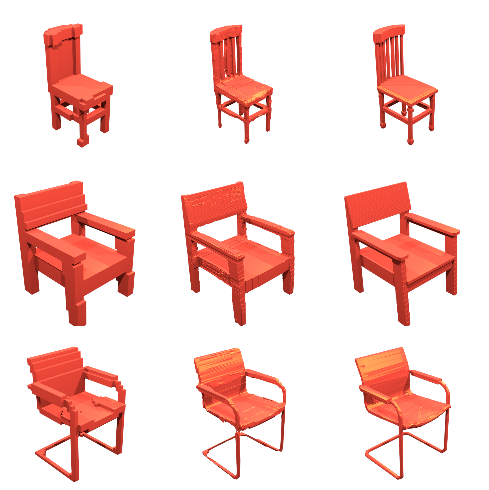
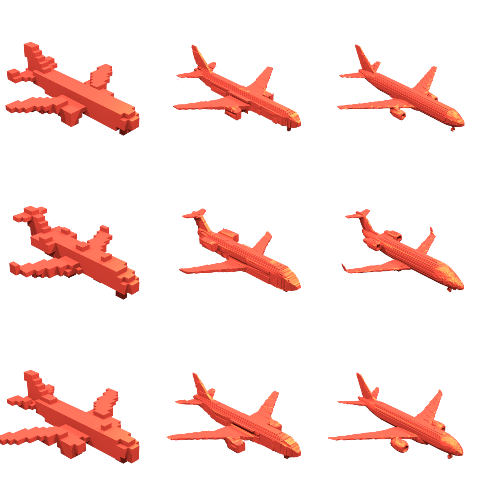
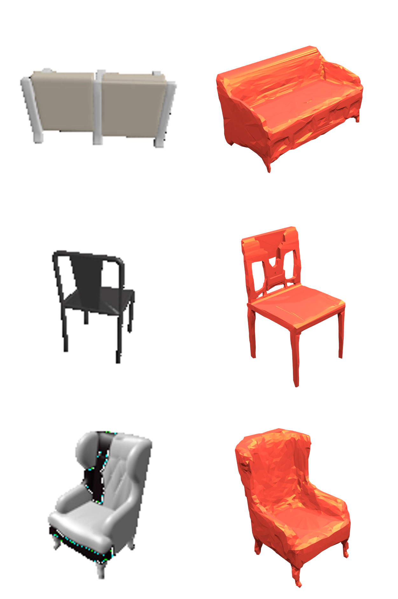
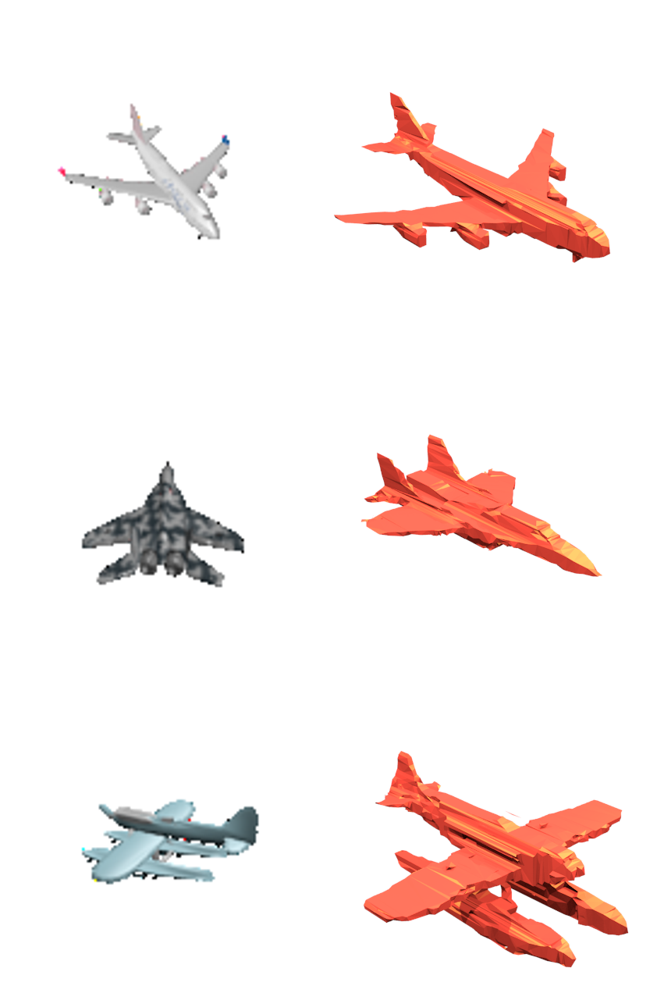

# Multi-View Silhouette and Depth Decomposition for High Resolution 3D Object Representation
This is a repository to reproduce the method from the paper "Multi-View Silhouette and Depth Decomposition for High Resolution 3D Object Representation". The code here allows one to train models to accurately and efficiently upsample voxelized objects to high resolutions, and to reconstruct voxelized objects from single RGB images at high resolutions.

<p align="center">
  
</p>
<sub>Example super-resolution results, when increasing from 32^3 resolution to 256^3 resolution. </sub>

<p align="center">
  
<p align="center">
  
</p>
<sub>An example reconstruction result from a single image.</sub>

## Data Production
 To produce the data needed to train and test the methods of this project we have the 'data_prep.py' script. This will download CAD models from the core classes of the ShapeNet data set, convert the objects to voxel objects, extract orthographic depth maps, render the objects as images, and split all the data into training, validation of test sets. This script makes use of the binvoxer executable, so first call
 ```bash
sudo chmod 777 binvox 
```
Blender is also needed for this project so please ensure it is installed before beginning. 
 ```bash
sudo apt install blender
```
By default this scripts downloads the full chair class, to upscale from 32^3 to 256^3 resolution, and renders 10 images for each object. To achieve this call:
 ```bash
python data_prep.py
```
As an example to further understand how to customize the data, to produced 1000 plane objects for 64 -> 128 resolution increase, and render 5 images per plane object call:
 ```bash
python data_prep.py  -o plane -no 1000 -hi 128 -l 64 -ni 5  
```

## Super-Resolution
The first element of this repo is the 3D super-resolution method. For this method 6 primary orthographic depth maps(ODM) are extracted from the low resolution object, and passed through our image super resolution method to produce a prediction for the corresponding high resolution object's 6 primary OMDs. The predicted ODM's are then used to carve away at the low resolution object(upsampled to the higher resolution using nearest neighbor interpolation), to produce an estimate for the high resolution object. 

A novel multi-view decomposition framework used to predict high resolution odms, which makes use to two deep convolutional neural networks. The first network, F_D,  outlined in 'depth.py', is used to predict fine details in the new object's surface, and estimates only the new depths into the known surface of the low resolution object within a predefined range. The output of this network is added the corresponding low resolution odms(upsampled to the higher resolution), to produce a complete estimate for the depths to the new object's surface. The second network, F_SIL, outlined in 'occupancy.py", is used to predict the obejct;s full structure by estimating an occupancy map for the high resolution ODM, basically predicting silhouettes for the predicted object. The outputs of these two networks are combined to produce a complete estimate of the high resolution ODM, which is then used to carve away at the low resolution object input. 


<sub>A diagram to understand the multi-view decomposition framework. </sub>

 - To train the depth map prediction network call: 

```bash
python depth.py
```

 - To train the occupancy map prediction call: 

```bash
python occupancy.py
```

- To evaluate the Super Resolution prediction call: 

```bash
python SREval.py
```
These all assume the default chair class is being increased from resolution 32 to resolution 256. To alter this call each script with the -h argument to view how to change each parameter. The two networks should not need more then 100 epochs to train fully, and graphs are created and saved in the '/plots/' directory should you wish to stop training early. The 'SREval.py' script will show predicted high resolution objects one at a time using meshlab. If you do not have meshlab installed call:

```bash
sudo apt-get install meshlab
```
This script is a little slow as converting large voxel arrays into a meshes for viewing takes some time. The actual method is quite fast. 

<ul align="center">
  
  
</ul>
<sub>Example objects super-resolution resolution results. High definition copies of these images can be found in the Images folder. </sub>

## High Resolution Single Image Object Reconstruction 


<sub>Object reconstruction examples from single images.</sub>


The second element of this repo is applying our Super-Resolution method to reconstructing high resolution objects from single RGB images. For this application an auto-encoder is used to produce low resolution reconstructions of objects from images, and then our super resolution method is applied to the resulting objects to produce high resolution reconstructions. 


<sub>The full pipeline for high resolution 3D object reconstruction from images.</sub>

Assuming the depth and occupancy predictors have already been trained simply call the following code to train an auto-encoder for the low resolution reconstruction:
```bash
python recon.py 
```
To understand how to change the parameters of the function, call with the -h argument. One can test with only a single auto-encoder, however, should you wish to achieve higher accuracy you can also train an ensemble. To train further models, call:
```bash
python recon.py -ensemble K
```
where ```K``` is the current ensemble number, the default number is zero. 

To test to perfomance of the trained models call: 
```bash
python ReconEval.py
```
This function will show the input image and render the produced high resolution object one at a time. Again, the largest overhead in this script is converting the voxel objects into meshes for visualization. To understand how to change the parameters of this script use the -h argument when calling. All parameters are set by default to using the chair class and increase the resolution from 32^3 to 256^3. 

<ul align="center">
  
  
</ul>
<sub>Example objects reconstructed from images.</sub>

## Reference:
please cite my paper: https://arxiv.org/pdf/1802.09987.pdf ,if you use this repo for research with following bibtex: 

            @incollection{NIPS2018_7883,
            title = {Multi-View Silhouette and Depth Decomposition for High Resolution 3D Object Representation},
            author = {Smith, Edward and Fujimoto, Scott and Meger, David},
            booktitle = {Advances in Neural Information Processing Systems 31},
            editor = {S. Bengio and H. Wallach and H. Larochelle and K. Grauman and N. Cesa-Bianchi and R. Garnett},
            pages = {6479--6489},
            year = {2018},
            publisher = {Curran Associates, Inc.},
            url = {http://papers.nips.cc/paper/7883-multi-view-silhouette-and-depth-decomposition-for-high-resolution-3d-object-representation.pdf}
            }

